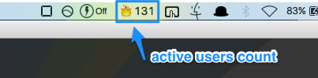

Show active users count of your web site
---

This bitbar plugin shows active users count of your web site in real time on your Mac menu bar. :smile:

<center></center>


### Requirements

- BitBar

- Python3

	- json
	
	- httplib2
	
	- google-api-python-client
	
	```
	sudo pip install --upgrade json httplib2 google-api-python-client
	```

- Your web site and Google Analytics account

### Installation

1. Create a directory for bitbar.
2. Download [fetch_active_users_count.py](fetch_active_users_count.1m.py).
3. Create [config.json](config.json.sample) and donwload your secret key of google analytics. (refer [here](https://developers.google.com/analytics/devguides/reporting/core/v3/quickstart/service-py?hl=ja#enable))

### Licence

MIT License

### Refercences

- [official site](https://getbitbar.com/)

- [クソアプリ実行プラットフォームとしてのBitBar](https://www.artifactsauce.info/posts/2016/12/09/bitbar-as-a-platform-for-fxxking-app)
